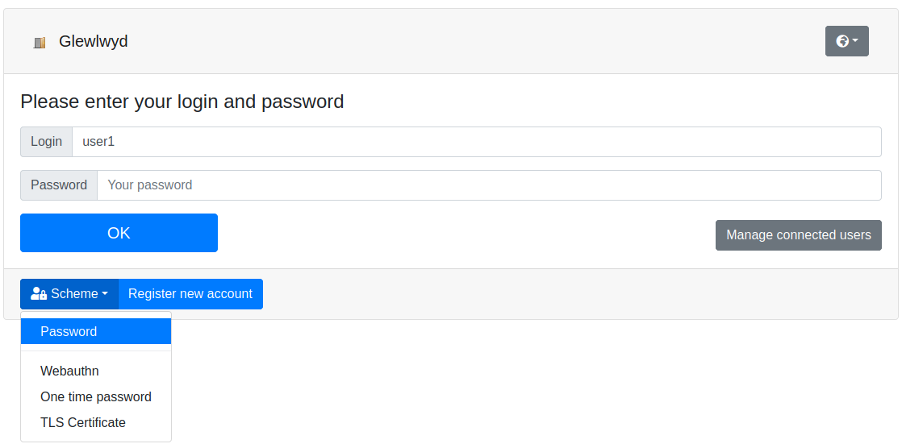

# Glewlwyd SSO server

[](https://travis-ci.com/babelouest/glewlwyd)

[](https://bestpractices.coreinfrastructure.org/projects/3475)

Single-Sign-On (SSO) server with multiple factor authentication.



Authentication processus supported:
- OAuth2
- OpenID Connect

Allows users to authenticate via multiple factors:
- Password
- One-time password (TOTP/HOTP)
- Webauthn (Yubikey, Android devices)
- One-time password sent via e-mail
- TLS Certificate
- External OAuth2/OIDC providers

Users and clients can be stored and managed from various backends:
- Database
- LDAP service
- HTTP Backend service providing Basic Authentication

Allows users to register a new account with the possibility to confirm their e-mail address or not. During the registration process, the new user may be expected to register their passwords, as well as other authentication factors:
- One-time password (TOTP/HOTP)
- Webauthn (Yubikey, Android devices)
- TLS Certificate
- External OAuth2/OIDC providers

See the [register documentation](docs/REGISTER.md) for more information on the registration features.

Based on a plugin architecture to make it easier to add or update storing backends, authentication schemes or processus.

Allows passwordless authentication.

Adding new authentication schemes or backend storage for users and clients is possible via the plugin architecture.

The backend API server is fully written in C and uses a small amount of resources.

Its plugin architecture makes it easy to add new modules or plugins, or modify existing ones with less risks to have unmaintainable code.

Glewlwyd 2.2 [is released](https://github.com/babelouest/glewlwyd/releases/tag/v2.2.0). Feel free to [install](docs/INSTALL.md), test it, and [send feedbacks](https://github.com/babelouest/glewlwyd/issues) if you feel like it.

Important! Due to a complete database reworking of the application, you can't upgrade an existing installation from Glewlwyd 1.x to Glewlwyd 2.x.

## Installation

The full installation documentation is available in the [install documentation](docs/INSTALL.md).

## Docker

A docker image is available for tests on localhost, run the following command:

```shell
$ docker run --rm -it -p 4593:4593 babelouest/glewlwyd
```

And open the address [http://localhost:4593/](http://localhost:4593/) on your browser.

- User: `admin`
- Password: `password`

More information in the [install documentation](docs/INSTALL.md#docker).

## Getting started

The [Getting started documentation](docs/GETTING_STARTED.md) will help administrators configure Glewlwyd's modules and authentication schemes.

## User documentation

The [user documentation](docs/USER.md) will help Glewlwyd's users manage their profile and log in to Glewlwyd.

## Core API

The full core REST API documention is available in the [API documentation](docs/API.md)

## Plugins architecture

You can update the existing plugins or add new ones depending on your needs, check out the documentation available for each type of plugin:
- [User backend modules](src/user/)
- [Client backend modules](src/client/)
- [Authentication schemes modules](src/scheme/)
- [Plugins](src/plugin/) (Register, OAuth2 or OIDC plugins)

## Screenshots

Go to the [Screenshots](docs/screenshots) folder to get a visual idea of Glewlwyd.

## Questions, problems or feature requests

You can open an [issue](https://github.com/babelouest/glewlwyd/issues) in github or send me an [e-mail](mailto:mail@babelouest.org). Any help is much appreciated!
