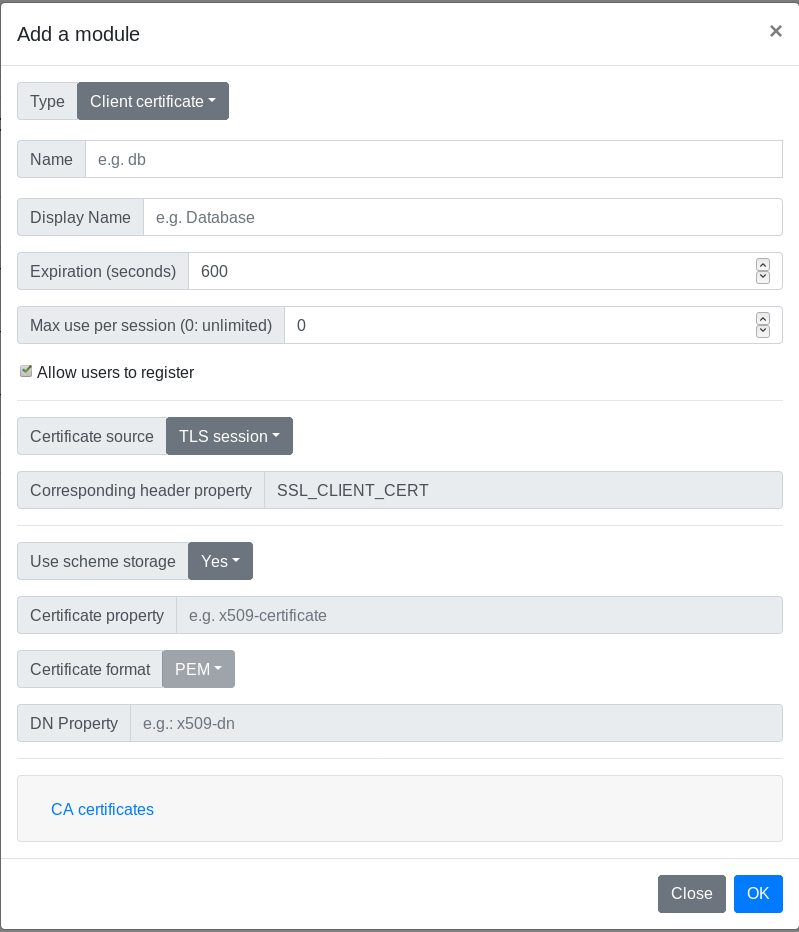

# Glewlwyd TLS Certificate Schema documentation

The TLS Certificate Schema implements authentification based on the [Client-authenticated TLS handshake](https://en.wikipedia.org/wiki/Transport_Layer_Security#Client-authenticated_TLS_handshake) protocol.

!!!Full disclosure!!!
This authentication scheme has been implemented based on the documentation and examples I could find. But there may be other and better ways to implement this type of authentication.
If you find bugs, weird behaviours, or wish new features, please [open an issue](https://github.com/babelouest/glewlwyd/issues) in the github repository or send an e-mail. 

## Installation

In the administration page, go to `Parameters/Authentication schemes` and add a new scheme by clicking on the `+` button. In the modal, enter a name and a display name (the name must be unique among all authentication scheme instances), and a scheme session expiration in seconds.
Select the type `Client certificate` in the Type dropdown button.

Below is the definition of all parameters.

### Name

Name (identifier) of the scheme, must be unique among all the scheme instances, even of a different type.

### Display name

Name of the instance displayed to the user.

### Expiration (seconds)

Number of seconds to expire a valid session.

### Max use per session (0: unlimited)

Maximum number of times a valid authentification with this scheme is possible. This is an additional parameter used to enforce the security of the session and forbid to reuse this session for other authentications.

### Allow users to register

If this option is unchecked, only administrator can register this scheme for every user via the administration page.

### Use scheme storage

If this option is set to `yes`, the registered certificates will be stored in the database, in a specific table for this scheme. If this option is set to `no`, the registered certificates will be extracted from the user properies.

### Certificate property

This option is mandatory if the option `Use scheme storage` is set to `no`. This is used to specify the user property that will hold the ceertificates used to authenticate the user.

### Certificate format

This option is available if the option `Use scheme storage` is set to `no`. This is used to specify the certificate format stored in the user properties: `PEM` or `DER`.

Because the internal format of the user properties is JSON, if the certificate format is set to `DER`, the certificate must be converted to base64. In fact, this option exists to use the LDAP property `userCertificate` which is stored in DER format. In that case, the property `userCertificate` must be converted in base64 in the LDAP backend configuration.

### CA Certificates

This section was designed to validate the client certificate using the full chain of trust until the root CA. After completing it, I realized it's may not be helpful since the user certificate must be validated with the CA file given in Glewlwyd config file.

### Use a CA

If this option is set to `yes`, the admin will be allowed to add the CA chain files to validate each user certificates.

Then, the admin can add one or multiple files by clicking `Browse`, select the file, then click `Upload`.
