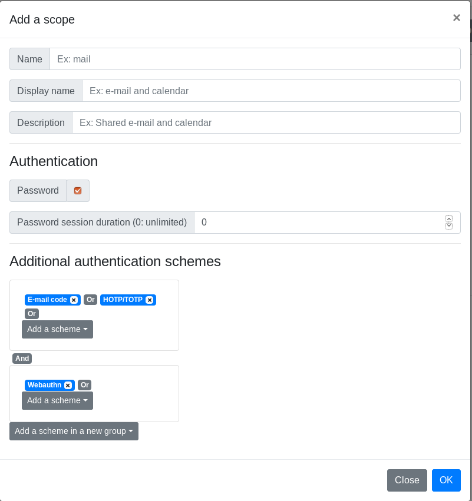

# Getting started with Glewlwyd 2.0

- [Installation](#installation)
- [First connection to the administration page](#first-connection-to-the-administration-page)
- [Configure backends, schemes, scopes and plugins](#configure-backends-schemes-and-plugins)
  - [User backend modules](#user-backend-modules)
    - [Database backend](#database-backend)
    - [LDAP backend](#ldap-backend)
    - [HTTP authentication backend](#http-authentication-backend)
  - [Client backend module](#client-backend-module)
    - [Database backend](#database-backend-1)
    - [LDAP backend](#ldap-backend-1)
  - [Authentication schemes](#authentication-schemes)
    - [E-mail code scheme](#e-mail-code-scheme)
    - [Webauthn scheme](#webauthn-scheme)
    - [HOTP/TOTP scheme](#hotptotp-scheme)
    - [TLS Certificate scheme](#tls-certificate-scheme)
    - [Retype-password scheme](#retype-password-scheme)
  - [Scopes](#scopes)
  - [Plugins](#plugins)
    - [Glewlwyd Oauth2 plugin](#glewlwyd-oauth2-plugin)
    - [OpenID Connect Core Plugin](#openid-connect-core-plugin)
  - [Configure environment to use Glewlwyd Oauth2](#configure-environment-to-use-glewlwyd-oauth2)
- [How-tos](#how-tos)
  - [Use case: Configure Glewlwyd to authenticate with Taliesin](#use-case-configure-glewlwyd-to-authenticate-with-taliesin)
  - [User profile delegation](#user-profile-delegation)
  - [Add or update additional properties for users and clients](#add-or-update-additional-properties-for-users-and-clients)
  - [Non-password authentication](#non-password-authentication)

The installation comes with a default configuration that can be updated or overwritten via the administration page or the configuration file.

The default configuration uses Glewlwyd's database as backend for users and clients. The scopes `g_admin` and `g_profile` (for admin page and profile page) are configured for a session duration of 10 minutes.

The following plugins are available but must be instanciated and configured either:

- Glewlwyd Oauth2 plugin
- Glewlwyd OpenID Connect Core plugin

## Installation

Install Glewlwyd via the packages, CMake or Makefile. See the [installation documentation](INSTALL.md) for more details.

## First connection to the administration page


Open the administration page in your browser. The default url is [http://localhost:4953/](http://localhost:4953/). Use the default login `admin` with the default password `password`.

Make sure to change the default password for the `admin` user to a more secure password.

## Configure backends, schemes and plugins

### User backend modules


Go to `parameters/user` menu in the navigation tab. Click on the `+` button to add a new user backend instance. The user backend modules available are:

- Database
- LDAP
- HTTP authentication

You can add the same instance of the same user backend module as many times as you want. A user backend module is identified by its module name and its instance name, example `database/localDB`, `ldap/companyAD`. The instance name must be unique though, i.e. you can't have `database/local` and `ldap/local` as user backend instances.

#### Database backend

The database backend requires an access to a database. You can use the same backend as the Glewlwyd server or use a different database. If you use a different database, it must be initialized with the script available in `src/user/database.[sqlite3|mariadb|postgresql].sql`.

Read the full [documentation](USER_DATABASE.md).

#### LDAP backend

The LDAP backend requires access to a LDAP service such as OpenLDAP or Active Directory.

Read the full [documentation](USER_LDAP.md).

#### HTTP authentication

With this user backend module, every time a user/password access is required, Glewlwyd will use the login/password provided to authenticate on the HTTP service configured and return the result: user valid, user invalid or server error. You must set at least one scope that will be available for all users connecting via this backend.

This module is read-only, and no user data will be stored in Glewlwyd's storage system, except the user sessions. Which means getting the user list of an HTTP backend will always return an empty list and getting the details of any username will return a build-up JSON object with the following data:

```javascript
// Response example for the username `user1`:
{
  "username": "user1",
  "scope": ["g_profile","scope1"],
  "enabled": true
}
```

Read the full [documentation](USER_HTTP.md).

### Client backend module


Go to `parameters/client` menu in the navigation tab. Click on the `+` button to add a new client backend instance. The client backend modules available are:

- Database
- LDAP

You can add the same instance of the same client backend module as many times as you want. A client backend module is distinguished by its module name and its instance name, example `database/localDB`, `ldap/companyAD`.

#### Database backend

The database backend requires an access to a database. You can use the same backend as the Glewlwyd server or use a different database. If you use a different database, it must be initialized with the script available in `src/client/database.[sqlite3|mariadb|postgresql].sql`.

Read the full [documentation](CLIENT_DATABASE.md).

#### LDAP backend

The LDAP backend requires access to a LDAP service such as OpenLDAP or Active Directory.

Read the full [documentation](CLIENT_LDAP.md).

### Authentication schemes


When an authentication scheme needs to store specific data for a user, it will use the database rather than the user backend. So a user will be able to register a scheme even if the user backend is in read-only mode.

Go to `parameters/schemes` menu in the navigation tab. Click on the `+` button to add a new scheme instance. The scheme modules available are:

- E-mail code scheme
- Webauthn scheme
- HOTP/TOTP scheme
- TLS Certificate scheme
- Retype-password scheme

You can add instances of the same scheme as many times as you want, if you need different configurations or to access different scopes in different contexts. A scheme instance is distinguished by its module name and its instance name, example `webauthn/AdminWebauthn`, `webauthn/UserWebauthn`.

Users will need to register some schemes such as HOTP/TOTP or Webauthn. If the option `Allow users to register` is unchecked for a scheme, the users won't be able to register it, only administrators via delegtion will be able to register for users.

#### E-mail code scheme

The requirements to use this scheme is a smtp server available, able to relay codes sent via `SMTP`.

Read the full [documentation](EMAIL.md).

#### Webauthn scheme

The Webauthn Schema implements authentification based on the [Webauthn API](https://w3c.github.io/webauthn/). This allows users to authenticate to Glewlwyd using physical devices: Android phones, Yubikeys, etc.

Read the full [documentation](WEBAUTHN.md).

#### HOTP/TOTP scheme

The OTP Schema implements authentification based on One-Time-Password using OATH standard defined in [HOTP](https://tools.ietf.org/html/rfc4226) and [TOTP](https://tools.ietf.org/html/rfc6238).

Read the full [documentation](OTP.md).

#### TLS Certificate scheme

The TLS Certificates scheme requires [SSL/TLS with CA certificate](https://github.com/babelouest/glewlwyd/blob/master/docs/INSTALL.md#ssltls) enabled or a reverse proxy configured to authenticate certificates and transfer the certificate data to Glewlwyd's API.

Read the full [documentation](CERTIFICATE.md).

#### Retype-password scheme

The Retype-password schema allows to mandatory retype the user password to authenticate, even if the session is authenticated with a valid password. This scheme may be useful to force user to retype its password in some critical process.

### Scopes


Go to `parameters/Scopes` menu in the navigation tab. Click on the `+` button to add a new scope.



Read the full [documentation for the scope management](SCOPE.md).

### Plugins


Go to `parameters/plugins` menu in the navigation tab. Click on the `+` button to add a new plugin instance. The plugins available are:

- Glewlwyd Oauth2 plugin
- OpenID Connect Core

#### Glewlwyd Oauth2 plugin

This module has the same behaviour as the legacy Glewlwyd 1.x Oauth2. The new features available are:

- Allow to use a refresh token as a `"rolling refresh"`, so every time an access token is refreshed, the lifetime of the refresh token will be reset to the original duration. Then if a token is refreshed periodically, users won't have to reconnect and request a new refresh token every 2 weeks or so.
- Allow to overwrite default `rolling refresh` setting and refresh token duration for every scope individually. `rolling refresh` disabled and the lowest refresh token duration have precedence in case of conflicting scopes settings.
- Allow to add mutiple user properties in the `access_token` rather than one.

Read the full [documentation](OAUTH2.md).

When the plugin instance is enabled, its endpoints available are:

- `/api/<instance_name>/auth`
- `/api/<instance_name>/token`
- `/api/<instance_name>/profile`

#### OpenID Connect Core Plugin

This plugin implements the OpenID Connect Core standard.

Read the full [documentation](OIDC.md).

When the plugin instance is enabled, its endpoints available are:

- `/api/<instance_name>/auth`
- `/api/<instance_name>/token`
- `/api/<instance_name>/userinfo`

### Configure environment to use Glewlwyd Oauth2

You need a resource service that requires glewlwyd access tokens to work. Some applications are available in my github repositories, like [Taliesin](https://github.com/babelouest/taliesin), an audio streaming server, [Hutch](https://github.com/babelouest/hutch), a password and secret locker, or [Angharad](https://github.com/babelouest/angharad), a house automation server.

You need to add a client, at least one scope, and setup the scope(s) for a user.

#### Create the client

Click on the `+` button on the client list page in Glewlwyd admin app. You must at least set a client_id, a redirect URI and the authorization types required.

#### Configure scopes

Go to `Scopes` menu in the navigation tab. Click on the `+` button to add a new Scope.

By default, a scope requires only the password for authentication. You can specify additional authentication schemes and/or unset password authentication. You can gather authentication schemes in groups to allow multiple authentication factor, and you can have multiple groups to force more than one additional authentication factor.

The authentication group model can be represented as the following schema:

Scope 1: password `AND` (mail `OR` webauthn) `AND` (TOTP `OR` certificate)

Scope 2: (mail `OR` certificate `OR` webauthn)

#### Setup the required scopes for a user

Go to `Users` menu in the navigation tab, Click on the `Edit` button for an existing user or click on the `+` button to add a new user. Then, set the previously created scope to this user.

When the user will connect to the client with Glewlwyd, he will need to validate the authentication schemes for the scopes required with this client.

## How-tos

### Use case: Configure Glewlwyd to authenticate with Taliesin

This use case is based on the following assertions:
- Glewlwyd is freshly installed with default configuration
- Glewlwyd is installed on the local machine and available at the address [http://localhost:4953/](http://localhost:4953/)
- Taliesin is installed on the local machine and available at the address [http://localhost:8576/](http://localhost:8576/)
- The scope `taliesin` will be configured as a rolling refresh, with password only
- The scope `taliesin_admin` will be configured as standard refresh token, without rolling refresh enabled, with password and OTP 2nd factor or Webauthn enabled
- The tokens are jwt signed with a RSA 256 key, the key file and the certificate must be available.

To create a RSA key/certificate pair, run the following commands on a linux shell with openssl installed:

```shell
$ # private key
$ openssl genrsa -out private-rsa.key 4096
$ # public key
$ openssl rsa -in private-rsa.key -outform PEM -pubout -out public-rsa.pem
```

Open the Glewlwyd admin page [http://localhost:4953/](http://localhost:4953/) in your browser, connect as administrator (admin/password)

#### Step 1: Change admin password

Click on the `Change password` menu on the navigation tab, there, you should change the `admin` password with a more efficient password.

#### Step 2: Add OTP and Webauthn schemes

Go to `parameters/schemes` menu in the navigation tab. Click on the `+` button to add a new scheme instance.

In the new scheme modal, enter in the name field `otp`, in the display name field `OTP`, select `HOTP/TOTP` in the type dropdown. Leave the other default parameters as is and click save. The scheme OTP should appear in the scheme list.

Then click again on the `+` button to add the Webauthn scheme. In the new scheme modal, enter in the field name `webauthn`, in the display name field `Webauthn`, select `Webauthn` in the type dropdown. Leave the other default parameters as is and click save. The scheme OTP should appear in the scheme list.

#### Step 3: Add scopes in Glewlwyd

- Add the scope `taliesin`, check the password checkbox
- Add the scope `taliesin_admin`, check the password checkbox and add the schemes `OTP` and `Webauthn` to the scope

#### Step 4: Add a Glewlwyd OAuth2 plugin instance

Go to `parameters/plugins` menu in the navigation tab. Click on the `+` button to add a new plugin instance.

In the new plugin modal, enter in the name field `glwd`, in the display name field `Glewlwyd OAuth2`, select `Glewlwyd OAuth2` in the type dropdown. There, select `RSA` as JWT type, 256 as key size, set your private and public key. Deploy `Specific scope parameters` and add the scope `taliesin_admin`, uncheck `rolling refresh` for this scope.

Click `Ok`.

#### Step 5: Add the client Taliesin

Go to `Clients` menu in the navigation tab. Click on the `+` button to add a new client.

In the new client modal, enter `taliesin` in the client ID field, `Taliesin` in the name field. Add the redirect uri `http://localhost:8576/`, add the following authorization types: `code`, `token` and `refresh_token`.

#### Step 6: Add a simple user and setup admin user

Go to `Users` menu in the navigation tab. Click on the `+` button to add a new user.

In the new user modal, enter `t_user` in the username field, `Taliesin User` in the name field, set a password (8 characters minimum), add the scopes `g_profile` and `taliesin`. Click `Ok`. The new user `t_user` should appear in the users list.

#### Step 7: configure OTP and Webauthn for admin

Click on the `delegate profile` button for the user `admin`. In the new page, select `otp` in the navigation bar.

Create a new OTP scheme for the user `admin`, select `TOTP` in the dropdown list, click on the `Generate` button to generate a random secret for this scheme, click `Save`. Your TOTP scheme is configured. Then you can reproduce this configuration on another device, like an OTP application on a smartphone. You can use the generated QR Code in the profile page.

Register a new Webauthn device. Select `Webauthn` in the navigation bar.

Two types of Webauthn devices are currently supported: `fido-u2f` types like Yubikeys and `android-safetynet` types like Android phones or tablet, version 7 or above. Click on the button `Register` to add a new registration. Follow the steps on your browser to complete the registration. You can test the authentification by clicking on the `Test` button.

#### Step 8: configure Taliesin's `config.json` file

Open the file `webapp/config.json` on an editor. The file should look like this now:

```json
{
	"taliesinApiUrl": "http://localhost:8576/api",
	"storageType": "local", 
	"useWebsocket": true,
	"oauth2Config": {
		"enabled": true,
		"storageType": "local", 
		"responseType": "code", 
		"serverUrl": "http://localhost:4593/api/glwd", 
		"authUrl": "auth", 
		"tokenUrl": "token", 
		"clientId": "taliesin", 
		"redirectUri": "http://localhost:8576/", 
		"scope": "taliesin taliesin_admin",
		"profileUrl": "profile"
	}
}
```

#### Step 9: Open taliesin in your browser

Open the url [http://localhost:8576/](http://localhost:8576/) in your browser.

Click on the login button, you should be redirected to Glewlwyd's login page.

There, log in with your admin password. After that, use the second factor authenticaiton of your choice. When completed, click on the `Continue` button which should be enabled. You will be redirected to Taliesin with a valid login and able to use the application as administrator, enjoy!

### User profile delegation


An connected administrator can update a user profile with the delegation functionality. A new window will open, allowing the administrator to update the user profile, register or de-register authentication schemes fot the user.


### Add or update additional properties for users and clients

Glewlwyd is designed to allow administrators to add or update additional properties for users and clients. The following paragraphs will explain how to add a new property for a user. The same process for the client is similar. All additional properties are strings, no other data format is possible.

#### Step 1: Add a specific data format

Edit the user module parameters. In the User Backend settings modal, deploy `Specific data format` and click on the `+` button. Enter the property name, ex `postal-code`.

The checkbox `multiple values` defines wether the new property values will be a single value or an array of multiple values.

The checkboxes `Read (admin)` and `Write (admin)` define wether this property is readable and/or writable on the user list in the administration page.

The checkboxes `Read (profile)` and `Read (profile)` define wether this property is readable and/or writable on the profile page.

#### Step 2: Update webapp/config.json to show the new property

Open the file `webapp/config.json` with a text editor. There, you must add a new JSON object in the array `pattern.user`.

The user pattern format is the following:

```javascript
{
  "name": "postal-code", // name of the new property, mandatory
  "type": "text", // values available are "text", "password" (hidden text) or "boolean" (checkbox), mandatory
  "list": true, // set this to true if the new property has `multiple values` checked, optional, default false
  "listElements": ["value1","value2"] // restrict the values available to this list if the new property has `multiple values` checked, optional
  "profile": false, // visible on the profile page, optional, default false
  "edit": true, // Can be updated, optional, default false
  "label": "admin.user-password", // i18next label name, label files is available in the files `webapp/locales/*/translations.json`, mandatory
  "placeholder": "admin.user-password-ph", // i18next placeholder value for text or password types, label files is available in the files `webapp/locales/*/translations.json`, optional, default empty
  "forceShow": true, // show the property even if the user has no value yet, optional, default false
  "required": true, // is the property mandatory?, optional, default false
  "profile-read": false, // can the user read the property in profile page, optional, default false
  "profile-write": false // can the user write the property in profile page, optional, default false
}
```

The Postal Code pattern should look like this:

```javascript
{
  "name": "postal-code",
  "list": false,
  "forceShow": true,
  "edit": true,
  "label": "admin.postal-code",
  "placeholder": "admin.postal-code-ph"
}
```

And the new entries in `webapp/locales/*/translations.json` should look like this:

```javascript
{
  // [...]
  "admin": {
    // [...]
    "postal-code": "Postal Code",
    "postal-code-ph": "Ex: X1Y 2Z3"
  }
}
```

Then you should see the new property in the user edit modal:


### Non-password authentication

Glewlwyd allows non-password authentication. You can use any other scheme installed to authenticate a user. If a required scope has the option `Password` checked, the password will be mandatory to grant access to this scope.

One or more schemes must be already installed: E-mail code, Webauthn, Client certificate or HOTP/TOTP. Then the scheme must be defined in the file `webapp/config.json` in the `sessionSchemes` array. The pattern is the following:

```javascript
{
  "scheme_type": "webauthn", // name of the module, mandatory
  "scheme_name": "webauthn", // name of the module instance, mandatory
  "scheme_display_name": "login.webauthn-title" // i18next label name, label files is available in the files `webapp/locales/*/translations.json`, mandatory
}
```

Then, in the login page for a new user, the dropdown `Scheme` will be available, allowing to authentify with the schemes specified.


