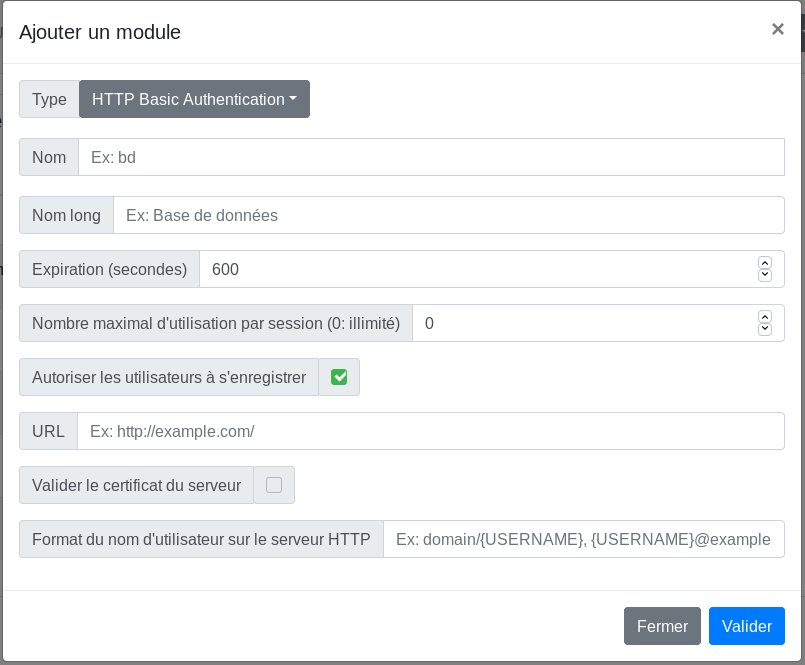

# Glewlwyd HTTP Basic Authentication Schema documentation

The HTTP Basic Authentication performs a login/password authentication against a specified webservice that requires HTTP Basic Authentication. This scheme is similar to [HTTP authentication backend](#http-authentication) but requires users to be already added to any backend (Database or LDAP). The advantage is that you can specify different scopes for each users and add any other additional data for the users.

## Installation

In the administration page, go to `Parameters/Authentication schemes` and add a new scheme by clicking on the `+` button. In the modal, enter a name and a display name (the name must be unique among all authentication scheme instances), and a scheme session expiration in seconds.
Select the type `HTTP Basic Authentication` in the Type dropdown button.

Below is the definition of all parameters.

### Name

Name (identifier) of the scheme, must be unique among all the scheme instances, even of a different type.

### Display name

Name of the instance displayed to the user.

### Expiration (seconds)

Number of seconds to expire a valid session.

### Max use per session (0: unlimited)

Maximum number of times a valid authentification with this scheme is possible. This is an additional parameter used to enforce the security of the session and forbid to reuse this session for other authentications.

### Allow users to register

If this option is unchecked, only administrator can register this scheme for every user via the administration page.

### URL

URL of the HTTP service to connect to.

### Validate server certificate

Check this option if the HTTP service uses TLS and if you want to validate the certificate.

### Username format on HTTP server

Fill this option if you want the users to enter their username only, without surrounding patterns. For example, if the login format on the HTTP server uses the format `\\domain\username`, then you can fill this option with `\\domain\{USERNAME}`. This option is optional, but if you fill it, the pattern `{USERNAME}` must be present in the format.
