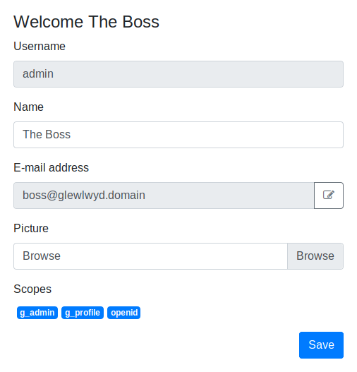
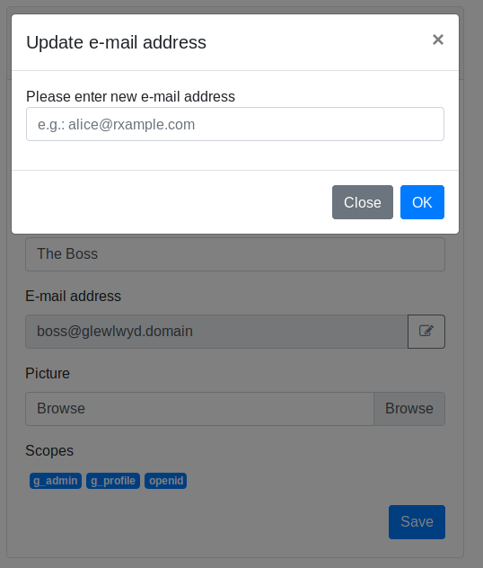
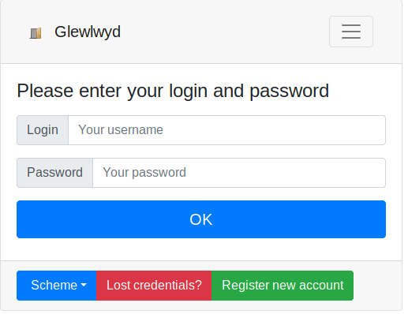
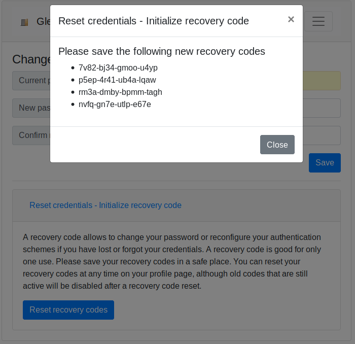
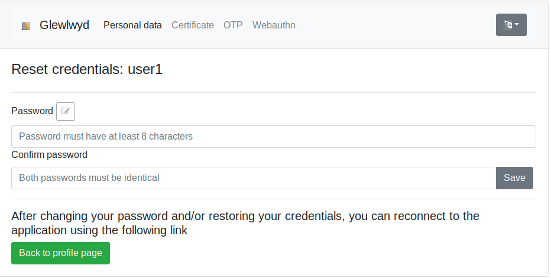

# Glewlwyd register new user plugin documentation

[](https://creativecommons.org/licenses/by-sa/4.0/)

This plugin allows to register new users in your Glewlwyd instance.

You have 3 different modes of user registration:
- The user can register without e-mail confirmation, it will need to use an available username
- The user must confirm an e-mail address to register, but can choose any available username
- The user must confirm an e-mail address to register, its username will be its e-mail address used for registration

During the registration process, the new user can register schemes and/or set a password. When you setup a registration instance, you need to set at least one authentication scheme to be mandatory for the user registration process.

You also need to set at least one scope to the new users, `g_profile` is recommended for the users to be able to connect to their profile page, you can also add any other scheme you may find relevant for your self-registered users.

- [Installation](#installation)
- [Registration URL](#registration-url)
- [Registration process for new users](#registration-process-for-new-users)

## Installation


In the administration page, go to `Parameters/Plugins` and add a new plugin by clicking on the `+` button. In the modal, enter a name and a display name (the name must be unique among all user backend instances).
Select the type `Register new user plugin` in the Type drop-down button.

Below is the definition of all parameters.

### Name

Name (identifier) of the plugin instance, must be unique among all the plugin instances, even of a different type.

### Display name

Name of the instance displayed to the user.

## Register account

#### Register account enabled

Check this if you want to enable user registration

#### Session identifier

Identifier for the session cookie used during the registration process

#### Session duration in seconds

Maximum duration of the registration session in seconds, default is 3600 (1 hour). If the new user didn't complete its registration before this duration, the user won't be available.

#### Password

Can the user set its password during the registration process? Values available are:
- `Mandatory` (default), the new user must set a password to complete the registration
- `Yes`, the new user can set a password, but it's not mandatory to complete the registration
- `No`, the new user can't set a password during the registration process

#### Scopes to add

The list of scopes that will be added to all new users that will use this registration process.

#### Add a scheme

Add an scheme instance that will be available for registration during the registration process.

##### Mandatory

A mandatory scheme means that the new user must register this scheme during the registration process to complete the registration.

#### Verify e-mail

Check this if you want the new users to verify their e-mail address during the registration process.

#### Username is e-mail

Check this if you want the new users to have their e-mail used as their username.

#### Verification code length

Length of the code that will be sent to the user's e-mail address.

#### Verification code duration (seconds)

Maximum lifetime of the code in seconds, default is 600 (10 minutes). If the new user didn't verify its e-mail address before this duration, the user will need to send another code.

#### E-mail sender address

Address used as sender in the e-mails, required.

#### Content-Type

Content-type for the e-mail content, default is `text/plain; charset=utf-8`

#### Lang

Drop-down value to select, add or remove lang templates for the e-mails.

#### Default lang

Checkbox to specify what lang is the default language.

#### E-mail subject

Subject used on the e-mails for the current lang, required.

#### E-mail body

The pattern for the body on the e-mails for the current lang, You must use at least once the string `{CODE}` in the pattern to be replaced by the code. The pattern {TOKEN} will be replaced by the token used to build the URL in the e-mail to get direct access to the validation step without entering the code.

Example, by using the following e-mail pattern:

```
The code is {CODE}

Or click on the following link: https://hunbaut.babelouest.org/glewlwyd2app/?registration=regis&token={TOKEN}
```

Users will receive the following message:

```
The code is: 123456

Or click on the following link: https://hunbaut.babelouest.org/glewlwyd2app/?registration=regis&token=abcxyz123[...]
```

### Update e-mail address

#### Token duration (seconds)

Maximum lifetime of the link send to the new e-mail in seconds, default is 600 (10 minutes). If the new user didn't verify its e-mail address before this duration, the user will need to send another token.

#### E-mail sender address

Address used as sender in the e-mails, required.

#### Content-Type

Content-type for the e-mail content, default is `text/plain; charset=utf-8`

#### Lang

Drop-down value to select, add or remove lang templates for the e-mails.

#### Default lang

Checkbox to specify what lang is the default language.

#### E-mail subject

Subject used on the e-mails for the current lang, required.

#### E-mail body

The pattern for the body on the e-mails for the current lang. The pattern {TOKEN} will be replaced by the token used to build the URL in the e-mail to validate the new e-mail address.

Example, by using the following e-mail pattern:

```
Click on the following link: https://hunbaut.babelouest.org/glewlwyd2app/?registration=regis&token={TOKEN}
```

Users will receive the following message:

```
Click on the following link: https://hunbaut.babelouest.org/glewlwyd2app/?registration=regis&token=abcxyz123[...]
```

### Reset credentials

#### Session identifier

Identifier for the session cookie used during the reset credentials process

#### Session duration in seconds

Maximum duration of the reset credentials session in seconds, default is 3600 (1 hour). If the new user didn't complete its reset credentials before this duration, the process must be restarted.

#### Use e-mail to reset credentials

Check this if you want to allow the user to send an e-mail to its adress to receive a link to access the reset credentials page for its profile.

#### Token duration (seconds)

Maximum lifetime of the link send to the new e-mail in seconds, default is 600 (10 minutes). If the new user didn't verify its e-mail address before this duration, the user will need to send another token.

#### E-mail sender address

Address used as sender in the e-mails, required.

#### Content-Type

Content-type for the e-mail content, default is `text/plain; charset=utf-8`

#### Lang

Drop-down value to select, add or remove lang templates for the e-mails.

#### Default lang

Checkbox to specify what lang is the default language.

#### E-mail subject

Subject used on the e-mails for the current lang, required.

#### E-mail body

The pattern for the body on the e-mails for the current lang. The pattern {TOKEN} will be replaced by the token used to build the URL in the e-mail to send the reset credentials link.

Example, by using the following e-mail pattern:

```
Click on the following link: https://hunbaut.babelouest.org/glewlwyd2app/?registration=regis&token={TOKEN}
```

Users will receive the following message:

```
Click on the following link: https://hunbaut.babelouest.org/glewlwyd2app/?registration=regis&token=abcxyz123[...]
```

#### Use recovery code to reset credentials

Check this if you want to allow the user to generate secret codes and store hash of them in order to start their reset credentials process.

#### Number of recovery codes available

Maximum number of recovery codes available.

### SMTP Parameters

#### SMTP Server

Address of the SMTP server that will relay the messages to the users, mandatory.

#### Port SMTP (0: System default)

TCP port the SMTP server is listening to. Must be between 0 and 65535. If 0 is set, Glewlwyd will use the system default port for SMTP, usually 25 or 587, mandatory.

#### Use a TLS connection

Check this option if the SMTP server requires TLS to connect.

#### Check server certificate

Check this option if you want Glewlwyd to check the SMTP server certificate before relaying the e-mail. This is highly recommended if TLS connection is checked, useless otherwise.

#### SMTP username (if required)

username used to authenticate to the SMTP server if required by the SMTP server, optional.

#### SMTP password (if required)

password used to authenticate to the SMTP server if required by the SMTP server, optional.

## Registration process

### Registration URL

The URL to access to the registration page has the following format:

```
https://<your_glewlwyd_url>/profile.html?register=<your_registration_instance_name>
```

Example, if your registration [name](#name) is `registration`: [http://localhost:4593/profile.html?register=registration](http://localhost:4593/profile.html?register=registration)

You can directly use this link in your network.

The parameter `name` corresponds to the register instance name, the parameter `message` will be replaced by an internationalization message in the `webapp/locales/*/translation.json` files.
The `register` parameter is a JSON array containing one or multiple JSON objects, each one with a property `name` and a property `message` in it.

### Add a link in the login page

You can add a link to the registration page from the login page. You need to add a `register` entry in the `webapp/config.json` page. The entry has the following format:

```json
"register": [
  {
    "name": "register",
    "message": "login.register-link"
  }
]
```

### Add a link at the end of the registration process

When the registration process is complete, the user may have different link choices.

If the user has clicked on the button `Register new user` on the login page, a button `Back to login page` will be avilable. If you want to add one or more links on this page to your applications, you must add an entry in the "register-complete" array. The entry has the following format:

```json
"register-complete": [
  {
    "name": "register",
    "complete-link": "https://www.example.com/login/",
    "complete-link-label": "profile.register-complete-link"
  }
]
```

- The `name` entry must correspond to your register plugin name.
- The `complete-link` entry must correspond to your landing page.
- The `complete-link-label` is a locales entry in the `webapp/locales/*/translation.json` files.

And finally, if no button `Back to login page` or `register-complete` is availalbe, a button `Back to profile page` will be available.

## Registration process for new users

When a new user will register to your Glewlwyd service, depending on the configuration, the 3 following screens will appear.

### No e-mail verification

`Verify e-mail` is unchecked in the admin page of the plugin.

The new user doesn't have to verify its e-mail address, it must only choose a valid, unused username.


Note: by using this method, the user can't enter an e-mail address, so the e-mail scheme won't be available for this user.

### E-mail verification and valid username

`Verify e-mail` is checked and `Username is e-mail` is unchecked in the admin page of the plugin.

The new user must enter a valid username, but also an e-mail address.


### Use e-mail as username

`Verify e-mail` is checked and `Username is e-mail` is checked in the admin page of the plugin.

The new must verify its e-mail address to register, the e-mail will be used as the username, so it must be unused in the users list as username.


### Enter personal data and register schemes if necessary

When the first step is complete, the new user must register one or more authentication method, such as choosing a password, registering an OTP, a TLS certificate, or a Webauthn device.

A message below the screen will explain to the user the mandatory schemes the user must achieve to be able to complete its registration.


### Cancel registration

The new user is allowed to cancel its registration before its completion. The user's data and scheme registrations will be removed.

### Complete registration

If all the mandatory steps are achieved, the new user can complete its registration. 


Then it should be able to connect to Glewlwyd and the applications using Glewlwyd authentication.

## Update e-mail process

If an existing user wants to update its e-mail address, it must validate the new address by clicking on a link send to the new address.

**Note for registered users with their e-mail address as their username**

This process will update the e-mail propserty only. If the user has registered through your Glewlwyd instance and the registration option `Username is e-mail` is set, the username will remain as the original e-mail address used to register.

### Change e-mail

The change e-mail button is available in the profile page of the user.



### Enter new e-mail address

When the user clicks on the edit button right to the e-mail input in the profile page, an input modal opens up and asks the user to enter the ne e-mail address. After clicking on the Ok button, an e-mail will be sent to the new address. In the e-mail, the user must click on the given link to validate its new e-mail address.



## Reset credentials process

When a user has losts its credentials (password or authentication scheme) that forbids to log in Glewlwyd properly, it can start the reset credentials process to recover its account. To reset its credentials, the user can either receive a link via e-mail or use a previously generated recovery code.

### Start the reset credentials process from the login page

In the login page, the user must click on the `Lost credentials?` button.



Then, the user must either enter its recovery code or send a link to its e-mail address. Depending on the reset credentials configuration, it can be only one method available to reset a user's credentials.


### Reset recovery codes in the profile page

The user can reset its reovery codes in the profile page in the `Password` tab. There, the user must expand the `Reset credentials - Initialize recovery code` accordion and click on the `Reset recovery codes` button. Then a modal window will appear containing new recovery codes. Then, the user must save this new recovery codes in a safe place to be able to recover its account.



Note that when a recovery code has been used to reset the user credentials, it will be disabled to avoid re-using a code more than once.

If a user has used all its recovery codes, it can sk for new codes in the proile page.

### Reset credentials page

Then, when the user has accessed its reset credentials page, it will be able to enter a new password and update or recover its scheme configuration if necessary.



## Register endpoints specifications

This documentation is intended to describe all the plugin endpoints behaviour.

### Prefix

All URIs are based on the plugin name you will setup. In this document, all API endpoints will assume they use the prefix `/api/register`.

### Get plugin configuration

#### URL

`/api/register/config`

#### Method

`GET`

#### Success response

Code 200

```javascript
{
  registration: {
    set-password: string, values possible are 'no', 'yes' or 'always' 
    schemes: [ // Array of schemes available for registration
      {
        module: string, module type
        name: string, module name
        register: string, values possible are 'yes' or 'always' 
        display_name: string, display name for the module
      }
    ],
    verify-email: boolean
    email-is-username:boolean
  },
  update-email: boolean
  reset-credentials: {
    email: boolean
    code: boolean
  }
}
```

### Check username

#### URL

`/api/register/username`

#### Method

`POST`

#### Body Parameters

```javascript
{
  username: string, mandatory
}
```

#### Success response

Code 200

The username is available

Code 400

Username unavailable

### Register a new user without e-mail validation

#### URL

`/api/register/register`

#### Method

`POST`

#### Body Parameters

```javascript
{
  username: string, mandatory
}
```

#### Success response

Code 200

The registration process has started.

A session cookie has been sent to the browser

Code 400

Username invalid or unavailable

Code 403

The new user must verify its e-mail address.

### Send e-mail verification code

#### URL

`/api/register/verify`

#### Method

`PUT`

#### Body Parameters

```javascript
{
  username: string, mandatory if the username is different from the e-mail in the plugin configuration
  email: string, mandatory
}
```

#### Success response

Code 200

The e-mail has been sent

Code 400

Error input parameters format

Code 403

The new user can't verify its e-mail address.

### Verify e-mail address

#### URL

`/api/register/verify`

#### Method

`POST`

#### Body Parameters

```javascript
{
  username: string, mandatory if the username is different from the e-mail in the plugin configuration and if token is missing or empty
  email: string, mandatory if token is missing or empty
  code: string, code verification, mandatory if token is missing or empty
  token:: string, token verification
}
```

#### Success response

Code 200

The e-mail is verified.

The registration process has started.

A session cookie has been sent to the browser

Code 400

Error input parameters

Code 403

The new user can't verify its e-mail address.

### Get current profile data

#### URL

`/api/register/profile`

#### Method

`GET`

#### Success response

Code 200

```javascript
{
  username: string, the username used to register
  name: string or null
  email: string or null
  password_set: boolean
}
```

Code 401

Invalid registration session

### Update password

#### URL

`/api/register/profile/password`

#### Method

`POST`

#### Body Parameters

```javascript
{
  password: string, mandatory
}
```

#### Success response

Code 200

Password updated

Code 400

Error input parameters

Code 401

Session invalid

Code 403

User is not allowed to change its password

### Update user full name

#### URL

`/api/register/profile`

#### Method

`PUT`

#### Body Parameters

```javascript
{
  name: string or null, mandatory
}
```

#### Success response

Code 200

Name updated

Code 400

Error input parameters

Code 401

Session invalid

### Can the user use the specified authentication scheme

#### URL

`/api/register/profile/scheme/register/canuse`

#### Method

`PUT`

#### Body Parameters

```javascript
{
  scheme_name: name of the scheme to check, mandatory
  username: string, mandatory
}
```

#### Success response

Code 200

Scheme is registered for this user

Code 400

Error input parameters

Code 401

Session invalid

Code 402

Scheme is available but not registered for this user

Code 403

Scheme is unavailable for this user

### Get scheme registration

#### URL

`/api/register/profile/scheme/register`

#### Method

`PUT`

#### Body Parameters

```javascript
{
  scheme_name: name of the scheme to check, mandatory
  username: string, mandatory
}
```

#### Success response

Code 200

Get the scheme registration data. The response depends on the scheme.

See [Authentication Scheme APIs](API.md#authentication-scheme-apis)

Code 400

Error input parameters

Code 401

Session invalid

### Update scheme registration

#### URL

`/api/register/profile/scheme/register`

#### Method

`POST`

#### Body Parameters

```javascript
{
  scheme_name: name of the scheme to check, mandatory
  username: string, mandatory
  data: object, mandatory
}
```

#### Success response

Code 200

Scheme registration updated.

Depending on the scheme and the command, the response may also contain JSON data.

Code 400

Error input parameters

Code 401

Session invalid

### Cancel current registration

#### URL

`/api/register/profile`

#### Method

`DELETE`

#### Success response

Code 200

Registration has been canceled

Code 401

Session invalid

### Complete registration

#### URL

`/api/register/profile/complete`

#### Method

`POST`

#### Success response

Code 200

User has been successfully created

Code 400

Some authentication schemes must be registered to complete the registration

Code 401

Session invalid

### Trigger update e-mail

#### URL

`/api/register/update-email`

#### Method

`POST`

#### Security

The user must use a valid profile session cookie

#### Body Parameters

```javascript
{
  email: new e-mail to verify, mandatory
}
```

#### Success response

Code 200

Link sent to the new e-mail address.

Code 400

Error input parameters

Code 401

Session invalid

### Verify updated e-mail

#### URL

`/api/register/update-email/:token`

#### Method

`PUT`

#### URL Parameters

```
token: token used to verify the new e-mail, mandatory
```

#### Success response

Code 200

User profile updated with the new e-mail address.

Code 403

Token invalid

### Get current profile data (reset credentials)

#### URL

`/api/register/reset-credentials/profile`

#### Method

`GET`

#### Success response

Code 200

```javascript
{
  username: string, the username used to register
  scheme: [
    {
      module: string, type of scheme
      name: string, identifier of the scheme
    }
  ]
}
```

Code 401

Session invalid

### Update password (reset credentials)

#### URL

`/api/register/reset-credentials/profile/password`

#### Method

`POST`

#### Body Parameters

```javascript
{
  password: string, mandatory
}
```

#### Success response

Code 200

Password updated

Code 400

Error input parameters

Code 401

Session invalid

Code 403

User is not allowed to change its password

### Can the user use the specified authentication scheme (reset credentials)

#### URL

`/api/register/reset-credentials/profile/scheme/register/canuse`

#### Method

`PUT`

#### Body Parameters

```javascript
{
  scheme_name: name of the scheme to check, mandatory
  username: string, mandatory
}
```

#### Success response

Code 200

Scheme is registered for this user

Code 400

Error input parameters

Code 401

Session invalid

Code 402

Scheme is available but not registered for this user

Code 403

Scheme is unavailable for this user

### Get scheme (reset credentials)

#### URL

`/api/register/reset-credentials/profile/scheme/register`

#### Method

`PUT`

#### Body Parameters

```javascript
{
  scheme_name: name of the scheme to check, mandatory
  username: string, mandatory
}
```

#### Success response

Code 200

Get the scheme data. The response depends on the scheme.

See [Authentication Scheme APIs](API.md#authentication-scheme-apis)

Code 400

Error input parameters

Code 401

Session invalid

### Update scheme (reset credentials)

#### URL

`/api/register/reset-credentials/profile/scheme/register`

#### Method

`POST`

#### Body Parameters

```javascript
{
  scheme_name: name of the scheme to check, mandatory
  username: string, mandatory
  data: object, mandatory
}
```

#### Success response

Code 200

Scheme registration updated.

Depending on the scheme and the command, the response may also contain JSON data.

Code 400

Error input parameters

Code 401

Session invalid

### Trigger reset credentials via e-mail

#### URL

`/api/register/reset-credentials-email`

#### Method

`POST`

#### Body Parameters

```javascript
{
  username: username to reset credentials
}
```

#### Success response

Code 200

Link sent to the corresponding e-mail address.

Code 400

Error input parameters

Code 401

Session invalid

### Verify reset credentials e-mail

#### URL

`/api/register/reset-credentials-email/:token`

#### Method

`PUT`

#### URL Parameters

```
token: token used to verify the reset credentials, mandatory
```

#### Success response

Code 200

A cookie session for the reset credentials process

Code 403

Token invalid

### Reset recovery codes

#### URL

`/api/register/reset-credentials-code`

#### Method

`PUT`

#### Security

The user must use a valid profile session cookie

#### Success response

Code 200

```javascript
[
  "code1",
  "code2",
  ...
]
```

Code 401

Session invalid

### Start a reset credentials session by verifying a recovery code

#### URL

`/api/register/reset-credentials-code`

#### Method

`POST`

#### Body Parameters

```javascript
{
  username: username to reset credentials
  code: valid recovery code
}
```

#### Success response

Code 200

A cookie session for the reset credentials process

Code 403

Code invalid
