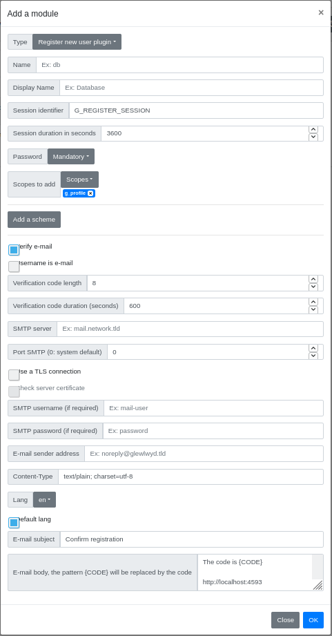
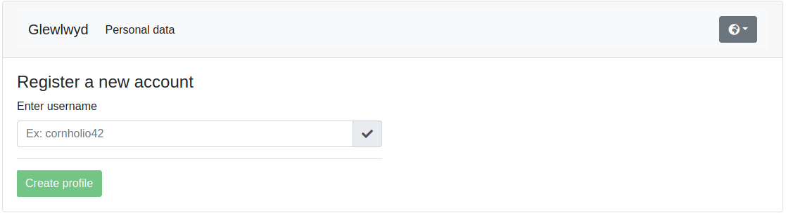
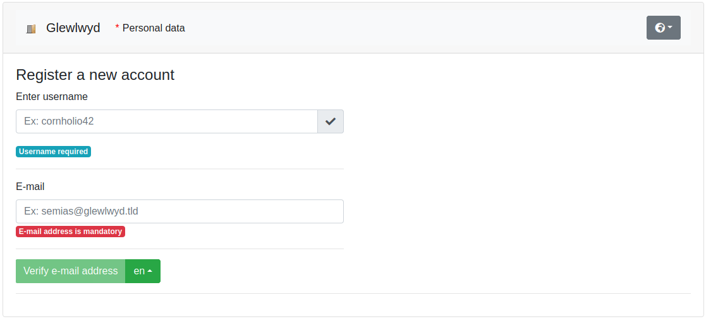
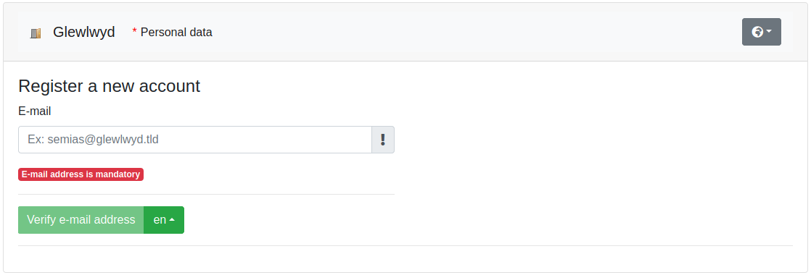
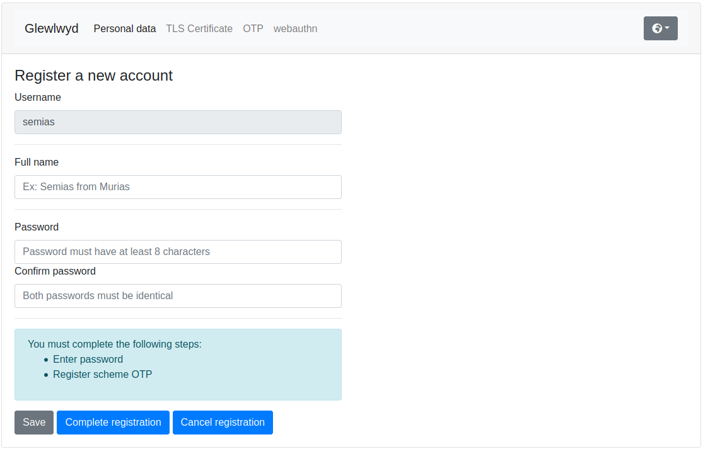
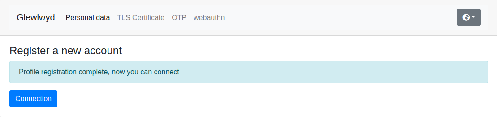

# Glewlwyd register new user plugin documentation

This plugin allows to register new users in your Glewlwyd instance.

You have 3 different modes of user registration:
- The user can register without e-mail confirmation, it will need to use an available username
- The user must confirm an e-mail address to register, but can choose any available username
- The user must confirm an e-mail address to register, its username will be its e-mail address used for registration

During the registration process, the new user can register schemes and/or set a password. When you setup a registration instance, you need to set at least one authentication scheme to be mandatory for the user registration process.

You also need to set at least one scope to the new users, `g_profile` is recommended for the users to be able to connect to their profile page, you can also add any other scheme you may find relevant for your self-registered users.

- [Installation](#installation)
- [Registration URL](#registration-url)
- [Registration process for new users](#registration-process-for-new-users)

## Installation



In the administration page, go to `Parameters/Plugins` and add a new plugin by clicking on the `+` button. In the modal, enter a name and a display name (the name must be unique among all user backend instances).
Select the type `Register new user plugin` in the Type dropdown button.

Below is the definition of all parameters.

### Name

Name (identifier) of the plugin instance, must be unique among all the plugin instances, even of a different type.

### Display name

Name of the instance displayed to the user.

### Session identifier

Identifier for the session cookie used during the registration process

### Session duration in seconds

Maximum duration of the registration session in seconds, default is 3600 (1 hour). If the new user didn't complete its registration before this duration, the user won't be available.

### Password

Can the user set its password during the registration process? Values available are:
- `Mandatory` (default), the new user must set a password to complete the registration
- `Yes`, the new user can set a password, but it's not mandatory to complete the registration
- `No`, the new user can't set a password during the registration process

### Scopes to add

The list of scopes that will be added to all new users that will use this registration process.

### Add a scheme

Add an scheme instance that will be available for registration during the registration process.

#### Mandatory

A mandatory scheme means that the new user must register this scheme during the registration process to complete the registration.

### Verify e-mail

Check this if you want the new users to verify their e-mail address during the registration process.

### Username is e-mail

Check this if you want the new users to have their e-mail used as their username.

### Verificiation code length

Length of the code that will be sent to the user's e-mail address.

### Verificiation code duration (seconds)

Maximum lifetime of the code in seconds, default is 600 (10 minutes). If the new user didn't verify its e-mail address before this duration, the user will need to send another code.

### SMTP Server

Address of the SMTP server that will relay the messages to the users, mandatory.

### Port SMTP (0: System default)

TCP port the SMTP server is listening to. Must be between 0 and 65535. If 0 is set, Glewlwyd will use the system default port for SMTP, usually 25 or 587, mandatory.

### Use a TLS connection

Check this option if the SMTP server requires TLS to connect.

### Check server certificate

Check this option if you want Glewlwyd to check the SMTP server certificate before relaying the e-mail. This is highly recommended if TLS connection is checked, useless otherwise.

### SMTP username (if required)

username used to authenticate to the SMTP server if required by the SMTP server, optional.

### SMTP password (if required)

password used to authenticate to the SMTP server if required by the SMTP server, optional.

### E-mail sender address

Address used as sender in the e-mails, required.

### Content-Type

Content-type for the e-mail content, default is `text/plain; charset=utf-8`

### E-mail subject

Subject used on the e-mails, required.

### E-mail body

The pattern for the body on the e-mails, You must use at least once the string `{CODE}` in the pattern to be replaced by the code. The pattern {TOKEN} will be replaced by the token used to build the url in the e-mail to get direct access to the validation step without entering the code.

Example, by using the following e-mail pattern:

```
The code is {CODE}

https://hunbaut.babelouest.org/glewlwyd2app/?registration=<your_registration_plugin_name>&token={TOKEN}
```

Users will receive the following message:

```
The code is: 123456

https://hunbaut.babelouest.org/glewlwyd2app/?registration=<your_registration_plugin_name>&token=abcxyz123[...]
```

## Registration URL

The url to access to the registration page has the following format:

```
https://<your_glewlwyd_url>/profile.html?register=<your_registration_instance_name>
```

Example, if your registration [name](#name) is `registration`: [http://localhost:4593/profile.html?register=registration](http://localhost:4593/profile.html?register=registration)

You can directly use this link in your network.

The parameter `name` corresponds to the register instance name, the parameter `message` will be replaced by an internationalization message in the `webapp/locales/*/translation.json` files.
The `register` parameter is a JSON array containing one or multiple JSON objects, each one with a property `name` and a property `message` in it.

### Add a link in the login page

You can add a link to the registration page from the login page. You need to add a `register` entry in the `webapp/config.json` page. The entry has the following format:

```json
"register": [
  {
    "name": "register",
    "message": "login.register-link"
  }
]
```

## Registration process for new users

When a new user will register to your Glewlwyd service, depending on the configuration, the 3 following screens will appear.

### No e-mail verification

`Verify e-mail` is unchecked in the admin page of the plugin.

The new user doesn't have to verify its e-mail address, it must only choose a valid, unused username.



Note: by using this method, the user can't enter an e-mail address, so the e-mail scheme won't be available for this user.

### E-mail verification and valid username

`Verify e-mail` is checked and `Username is e-mail` is unchecked in the admin page of the plugin.

The new user must enter a valid username, but also an e-mail address.



### Use e-mail as username

`Verify e-mail` is checked and `Username is e-mail` is checked in the admin page of the plugin.

The new must verify its e-mail address to register, the e-mail will be used as the username, so it must be unused in the users list as username.



### Enter personal data and register schemes if necessary

When the first step is complete, the new user must register one or more authentication method, such as choosing a password, registering an OTP, a TLS certificate, or a Webauthn device.

A message below the screen will explain to the user the mandatory schemes the user must achieve to be able to complete its registration.



### Cancel registration

The new user is allowed to cancel its registration before its completion. The user's data and scheme registrations will be removed.

### Complete registration

If all the mandatory steps are achieved, the new user can complete its registration. 



Then it should be able to connect to Glewlwyd and the applications using Glewlwyd authentication.

## Register endpoints specifications

This documentation is intended to describe all the plugin endpoints behaviour.

### Prefix

All URIs are based on the plugin name you will setup. In this document, all API endpoints will assume they use the prefix `/api/register`.

### Get plugin configuration

#### URL

`/api/register/config`

#### Method

`GET`

#### Success response

Code 200

```javascript
{
  set-password: string, values possible are 'no', 'yes' or 'always' 
  schemes: [ // Array of schemes available for registration
    {
      module: string, module type
      name: string, module name
      register: string, values possible are 'yes' or 'always' 
      display_name: string, display name for the module
    }
  ],
  verify-email: boolean
  email-is-username:boolean
}
```

### Check username

#### URL

`/api/register/username`

#### Method

`POST`

#### Body Parameters

```javascript
{
  username: string, mandatory
}
```

#### Success response

Code 200

The username is available

Code 400

Username unavailable

### Register a new user without e-mail validation

#### URL

`/api/register/register`

#### Method

`POST`

#### Body Parameters

```javascript
{
  username: string, mandatory
}
```

#### Success response

Code 200

The registration process has started.

A session cookie has been sent to the browser

Code 400

Username invalid or unavailable

Code 403

The new user must verify its e-mail address.

### Send e-mail verficiation code

#### URL

`/api/register/verify`

#### Method

`PUT`

#### Body Parameters

```javascript
{
  username: string, mandatory if the username is different from the e-mail in the plugin configuration
  email: string, mandatory
}
```

#### Success response

Code 200

The e-mail has been sent

Code 400

Error input parameters format

Code 403

The new user can't verify its e-mail address.

### Verify e-mail address

#### URL

`/api/register/verify`

#### Method

`POST`

#### Body Parameters

```javascript
{
  username: string, mandatory if the username is different from the e-mail in the plugin configuration and if token is missing or empty
  email: string, mandatory if token is missing or empty
  code: string, code verification, mandatory if token is missing or empty
  token:: string, token verification
}
```

#### Success response

Code 200

The e-mail is verified.

The registration process has started.

A session cookie has been sent to the browser

Code 400

Error input parameters

Code 403

The new user can't verify its e-mail address.

### Get current profile data

#### URL

`/api/register/profile`

#### Method

`GET`

#### Success response

Code 200

```javascript
{
  username: string, the username used to register
  name: string or null
  email: string or null
  password_set: boolean
}
```

Code 401

Invalid registration session

### Update password

#### URL

`/api/register/profile/password`

#### Method

`POST`

#### Body Parameters

```javascript
{
  password: string, mandatory
}
```

#### Success response

Code 200

Password updated

Code 400

Error input parameters

Code 401

Session invalid

Code 403

User is not allowed to change its password

### Update user full name

#### URL

`/api/register/profile`

#### Method

`PUT`

#### Body Parameters

```javascript
{
  name: string or null, mandatory
}
```

#### Success response

Code 200

Name updated

Code 400

Error input parameters

Code 401

Session invalid

### Can the user use the specified authentication scheme

#### URL

`/api/register/profile/scheme/register/canuse`

#### Method

`PUT`

#### Body Parameters

```javascript
{
  scheme_name: name of the scheme to check, mandatory
  username: string, mandatory
}
```

#### Success response

Code 200

Scheme is registered for this user

Code 400

Error input parameters

Code 401

Session invalid

Code 402

Scheme is available but not registered for this user

Code 403

Scheme is unavailable for this user

### Get scheme registration

#### URL

`/api/register/profile/scheme/register`

#### Method

`PUT`

#### Body Parameters

```javascript
{
  scheme_name: name of the scheme to check, mandatory
  username: string, mandatory
}
```

#### Success response

Code 200

Get the scheme registration data. The response depends on the scheme.

See [Authentication Scheme APIs](API.md#authentication-scheme-apis)

Code 400

Error input parameters

Code 401

Session invalid

### Update scheme registration

#### URL

`/api/register/profile/scheme/register`

#### Method

`POST`

#### Body Parameters

```javascript
{
  scheme_name: name of the scheme to check, mandatory
  username: string, mandatory
  data: object, mandatory
}
```

#### Success response

Code 200

Scheme registration updated.

Depending on the scheme and the command, the response may also contain JSON data.

Code 400

Error input parameters

Code 401

Session invalid

### Cancel current registration

#### URL

`/api/register/profile`

#### Method

`DELETE`

#### Success response

Code 200

Registration has been canceled

Code 401

Session invalid

### Complete registration

#### URL

`/api/register/profile/complete`

#### Method

`POST`

#### Success response

Code 200

User has been succesfully created

Code 400

Some authentication schemes must be registered to complete the registration

Code 401

Session invalid
