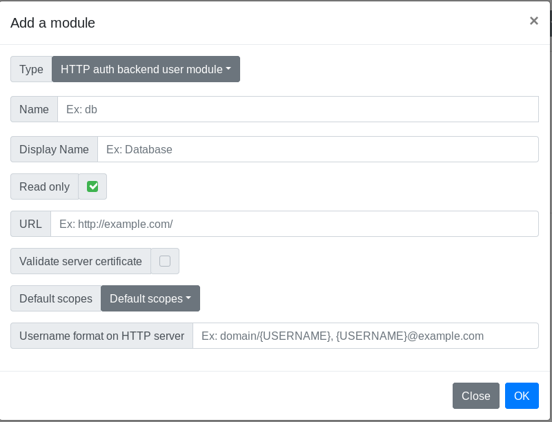

# Glewlwyd User Module HTTP Backend documentation



The http backend uses a HTTP service to authenticate users via Basic Auth.
By design, this backend module instance is always read-only. Listing users will always return an empty list, getting a single user will always return a JSON object, even if the user doesn't exist in the backend.

The HTTP request `GET /api/user/user1?backend=http` may return the following response:

```JSON
{
  "username": "user1",
  "scope": ["g_profile","scope1"],
  "enabled": true
}
```

The scopes returned are the one specified in the `Default scopes` property.

The authentication method used is the Basic HTTP authentication.

## Installation

In the administration page, go to `Parameters/Users data sources` and add a new user module by clicking on the `+` button. In the modal, enter a name and a display name (the name must be unique among all user backend instances).
Select the type `LDAP backend user module` in the Type dropdown button.

Below is the definition of all parameters.

### Name

Name (identifier) of the module instance, must be unique among all the user backend module instances, even of a different type.

### Display name

Name of the instance displayed to the user.

### Read only

Check this option if you want to use this backend as read-only. All user properties such as e-mail, name, password, scopes can't be modifier with Glewlwyd, even administrators.

### URL

URL of the HTTP service to connect to.

### Validate server certificate

Check this option if the HTTP service uses TLS and if you want to validate the certificate.

### Default scopes

Select all the scopes that will be available for a connected user. At least one scope is mandatory.

### Username format on HTTP server

Fill this option if you want the users to enter their username only, without surrounding patterns. For example, if the login format on the HTTP server uses the format `\\domain\username`, then you can fill this option with `\\domain\{username}`. This option is optional, but if you fill it, the pattern `{username}` must be present in the format.
