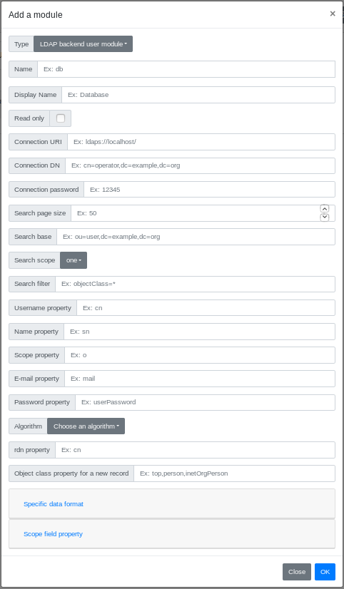

# Glewlwyd User Module LDAP Backend documentation

The database backend uses a LDAP service to store information and passwords for users.

## Installation

In the administration page, go to `Parameters/Users data sources` and add a new user module by clicking on the `+` button. In the modal, enter a name and a display name (the name must be unique among all user backend instances).
Select the type `LDAP backend user module` in the Type dropdown button.

Below is the definition of all parameters.

### Name

Name (identifier) of the module instance, must be unique among all the user backend module instances, even of a different type.

### Display name

Name of the instance displayed to the user.

### Read only

Check this option if you want to use this backend as read-only. All user properties such as e-mail, name, password, scopes can't be modifier with Glewlwyd, even administrators.

### Connection URI

URI to connect to the LDAP service, ex: ldaps://ldap.example.com/

### Connection DN

DN used to acces the LDAP service. The DN must have write access if you want to use this backend in write mode.

### Connection password

Password to use with the `Connection DN`.

### Search page size

Page size to list users in this backend. This option must be lower than the maximum of results that the LDAP service can send.

### Search base

Base DN to look for users.

### Search scope

Search scope on the LDAP Base DN. Values available are `one`, `subtree`, `children`.

### Search filter

Filter to apply when performing a search of users.

### Username property

Username of the user. This property will be used to build the search filter on a user connection.
You can specify multiple values by separating them with a comma `,`. On read mode, the first value will be used, on write mode, all values will be used.

### Name property

Name of the user.
You can specify multiple values by separating them with a comma `,`. On read mode, the first value will be used, on write mode, all values will be used.

### Scope property

Scopes available for the user. The LDAP property must store multiple values.
You can specify multiple values by separating them with a comma `,`. On read mode, the first value will be used, on write mode, all values will be used.

### E-mail property

Property used to store the user e-mail value.
You can specify multiple values by separating them with a comma `,`. On read mode, the first value will be used, on write mode, all values will be used.

### Password property.

Property used to store the user password. This property is not used if the instance is in read-only mode.
You can specify multiple values by separating them with a comma `,`. On read mode, the first value will be used, on write mode, all values will be used.

### Algorithm

Algorithm used to hash the user password. This property is not used if the instance is in read-only mode.

### rdn property

This property is mandatory to store the rdn property. This property is not used if the instance is in read-only mode.
You can specify multiple values by separating them with a comma `,`.

### Object class property for a new user

This value will contain all the object class values when Glewlwyd will create new users in the LDAP backend. Values must be separated with a comme `,`.

### Specific data format

This section allows to specify new properties for the user. The properties may be available for schemes, plugins, in the admin page or in the profile page.

#### Property

Property name, ex: `phone`, `address`, `human`, etc.

#### LDAP Property

Corresponding LDAP property name.

#### Multiple values

If this option is checked, the property values will be available as an array of string values, otherwise a single string value.

#### Read (admin)

If this option is checked, plugins, schemes and administrators can have access to this property in read mode.

#### Write (admin)

If this option is checked, plugins, schemes and administrators can have access to this property in write mode.

#### Read (profile)

If this option is checked, the user can have access to this property in read mode in its profile API.

#### Write (profile)

If this option is checked, the user can have access to this property in write mode in its profile API.

### Scope field property

This section allows to specify a correspondance between a Glewlwyd scope and a value in the scope property. The main goal is to use an existing LDAP service whose users have property that can be related to scopes (group names, etc.). For example, the group name value `accounting` will correspond to the scope `mail`.

#### LDAP value

LDAP value that must match.

#### Corresponding scope

Name of the scope that will be returned. This value must be an existing scope name.

#### Match

How the LDAP value must match.
