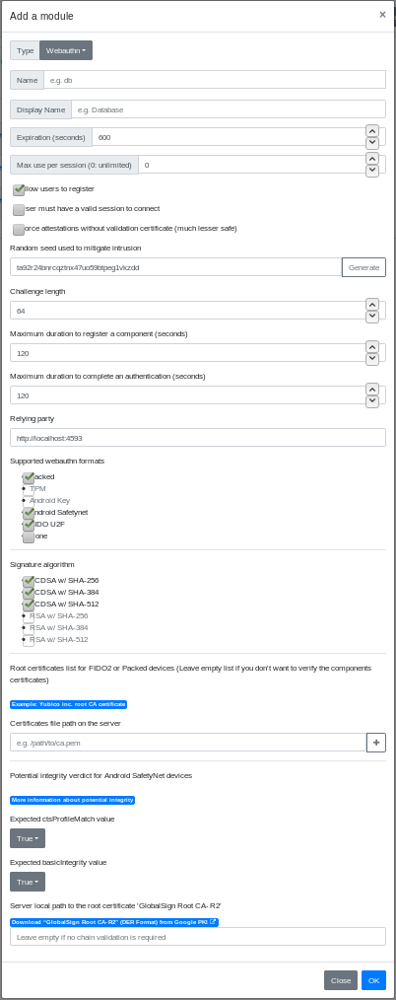

# Glewlwyd Webauthn Schema Documentation

The Webauthn Schema implements authentification based on the [Webauthn API](https://w3c.github.io/webauthn/). This allows users to authenticate to Glewlwyd using physical devices: Android phones, Yubikeys, etc.

The user needs to register its device to Glewlwyd first, then when a webauthn authentication is required, the user plugs its device, end the authentication process is validated without the users need to enter a password.

As for now, the following attestation formats are supported by Glewlwyd:
- Android Safetynet Attestation (Android devices with fingerprint or secret code)
- FIDO U2F Attestation (ex: Yubikeys)

## Installation

In the administration page, go to `Parameters/Authentication schemes` and add a new scheme by clicking on the `+` button. In the modal, enter a name and a display name (the name must be unique among all authentication scheme instances), and a scheme session expiration in seconds.
Select the type `Webauthn` in the Type dropdown button.

The default settings makes the scheme usable as is.

Below is the definition of all parameters.

### Name

Name (identifier) of the scheme, must be unique among all the scheme instances, even of a different type.

### Display name

Name of the instance displayed to the user.

### Expiration (seconds)

Number of seconds to expire a valid session.

### Max use per session (0: unlimited)

Maximum number of times a valid authentification with this scheme is possible. This is an additional parameter used to enforce the security of the session and forbid to reuse this session for other authentications.

### Allow users to register

If this option is unchecked, only administrator can register this scheme for every user via the administration page.

### Force attestation without validation certificate (much lesser safe)

Force all registration to Glewlwyd without a certificate (attestation set to 'none', therefore fmt returned is 'none'). Check this option if you don't want to manage FIDO2 devices chain of trust and want to accept all FIDO2 device a user wants to register.

### User must have a valid session to connect

This options allows or forbid users to authenticate via webauthn if they already have a valid session.
If you uncheck this option, you can use webauthn for a no-password authentication.

### Random seed used to mitigate intrusion

This setting is required if the option `User must have a valid session to connect` is unchecked. It will be used to generate fake users and authentication ids to mitigate intrusion attacks. So attacker won't be able to make the distinction between a valid user and a fake one. A random string is generated by your browser to fill this option. You can change it as you like, but be sure to enter a long string (~32 characters or more) for a significant entropy.

### Challenge length

Length of the challenge that will be sent to the webauthn device. Must be large to have enough entropy. Most webauthn devices require at least 32 bytes long, and recommend 64 or more.

### Maximum duration to register a component (seconds)

Maximum duration in seconds between the first step and the last step of the registration process.

### Maximum duration to complete an authentification (seconds)

Maximum duration in seconds between the first step and the last step of the authentification process.

### Relying party

Value of the relying party that will be used and compared to during the registration and authentication process. It must correspond to the address of the web server hosting the front-end application. It must be an `https://` address unless you're using only under `localhost` (but why would you?).

### Supported webauthn formats

Select the formats you want your Webauthn scheme to support. You must select at least one format. Format TPM and Android Key are not supported yet.

### Signature algorithm

Signature algorithms supported. Currently, only ECDSA signatures are supported.

### Certificate file path on the server

These are the certificates provided by the security key manufactors used to validate the full chain. If you enter no certificate, then no chain trust will be checked when a FIDO2 device will register, which can lead to man in the middle attack. Therefore you're strongly suggested to specify the manufactors you support.

### Android Safetynet integrity: Expected ctsProfileMatch value and Expected basicIntegrity value

These options are related to the potential integrity of the android devices used for authentication. This allows or forbid users to use a rooted android device or modified device.
More information is available in this [android developper](https://developer.android.com/training/safetynet/attestation#potential-integrity-verdicts) page.

### Server local path to the root certificate 'GlobalSign Root CA - R2'

This is used during the registration of an android device using webauthn. The device certificate will be validated with the 'GlobalSign Root CA certificate - R2'.
It is highly recommended to [download](https://pki.goog/) this certificate to the server hosting Glewlwyd in DER format and fill this option.

The reason why this certificate isn't hardcoded in Glewlwyd source code or isn't shipped with Glewlwyd package is because Google won't allow to redistribute the certificate in terms compatible with [Glewlwyd's license](../LICENSE).
