# Glewlwyd screenshots

Screenshots available

## Login page

### Simple login with password

### Login without password

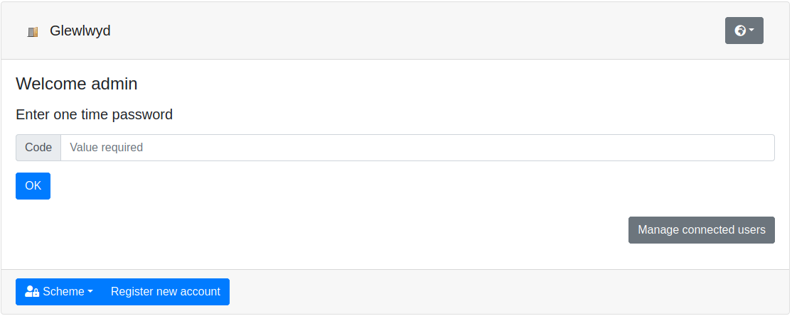

### Grant client access to scopes for the user

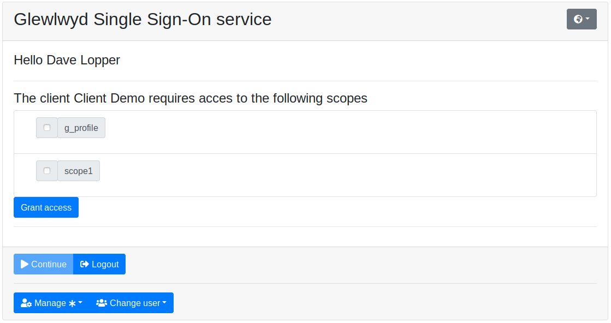

### Multiple session selector

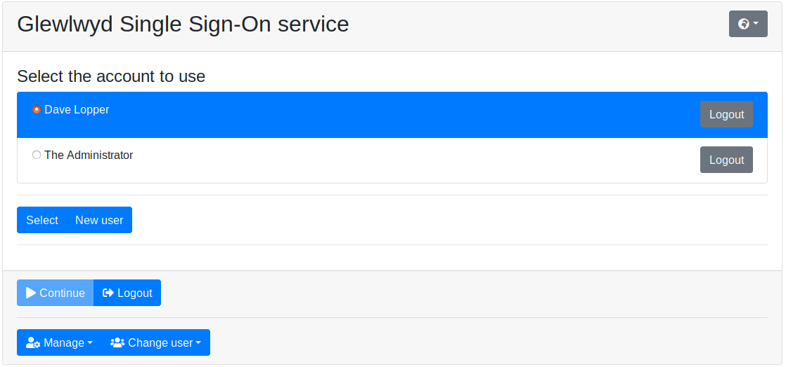

### Logged in

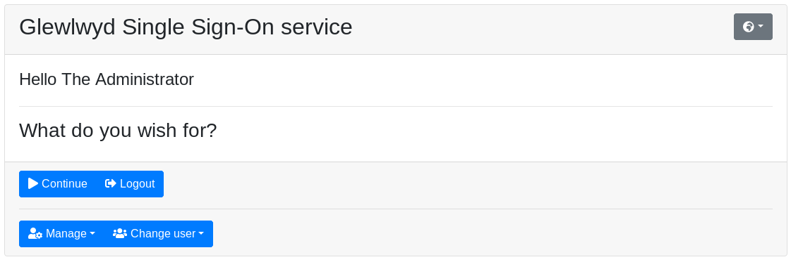

## Admin page

### User list

### Client list

### Scope list

### Scope add

### List of user modules instanciated

### User database backend module configuration

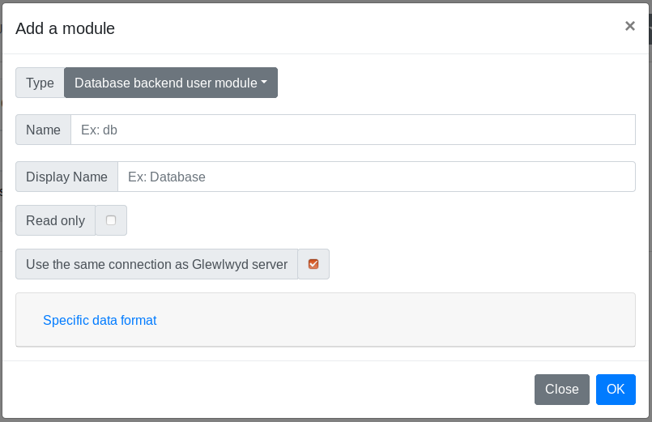

### User HTTP backend module configuration

### User LDAP backend module configuration

### Client LDAP backend module configuration

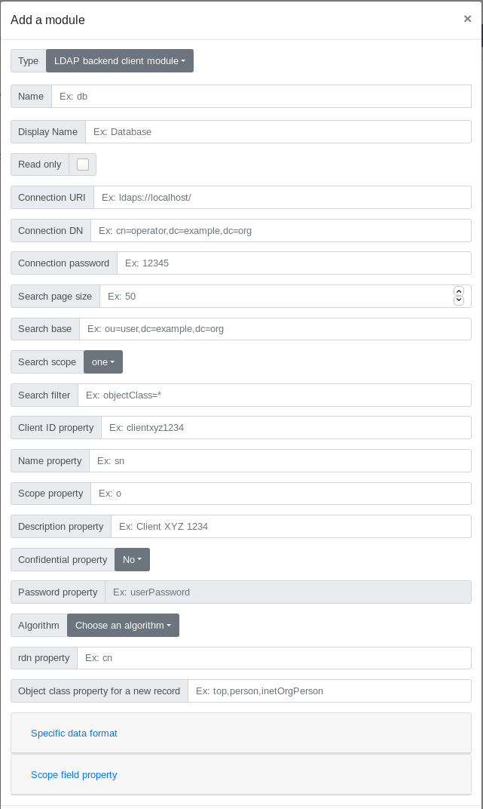

### Scheme list

### OTP E-mail scheme configuration

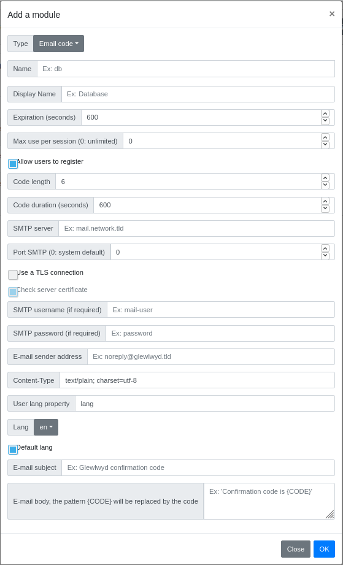

### OATH HOTP/TOTP scheme configuration

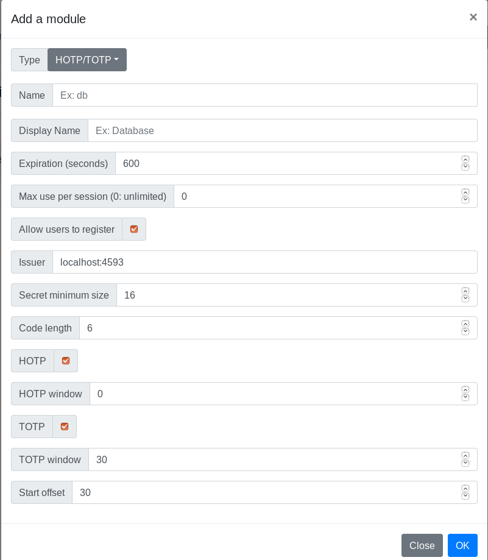

### Webauthn scheme configuration

## Profile page

### User profile data editor

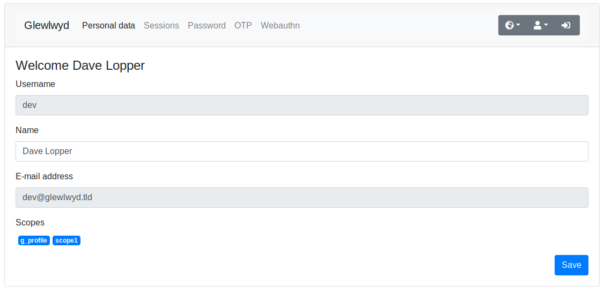

### User profile change password

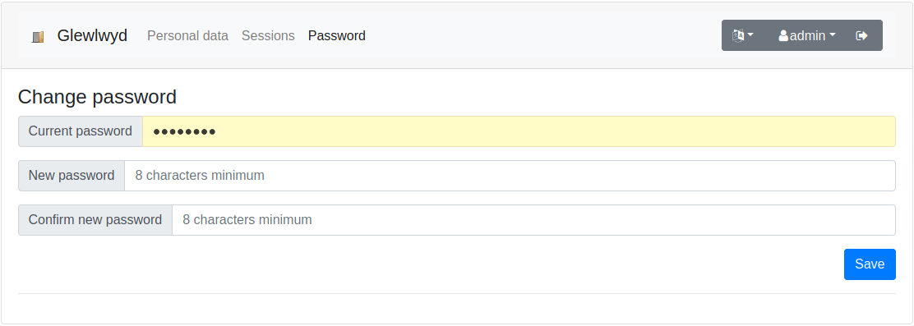

### User profile session and tokens manager

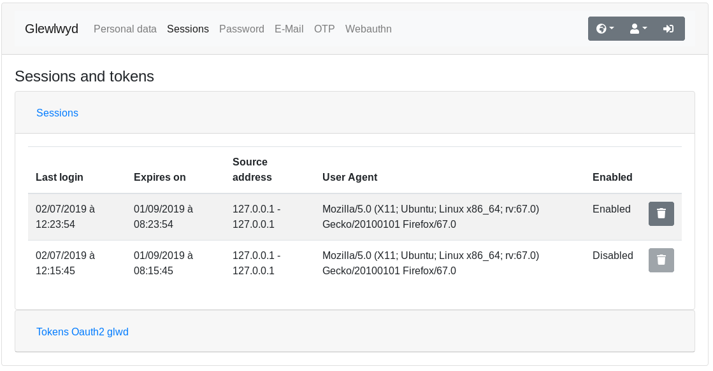

### User profile OTP configuration

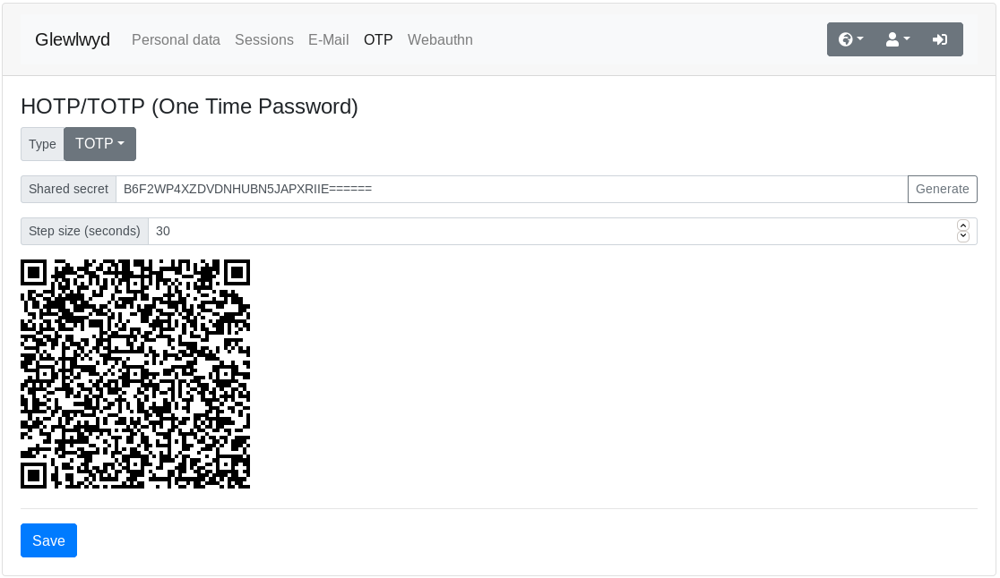

### User profile Webauthn configuration

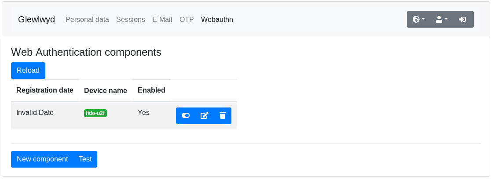

### User profile TLS certificate configuration

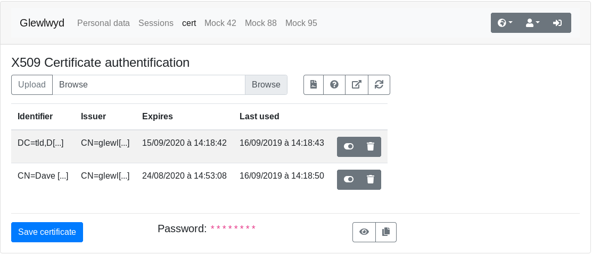

### List of plugins instanciated

### OAuth2 plugin configuration

### OIDC plugin configuration

