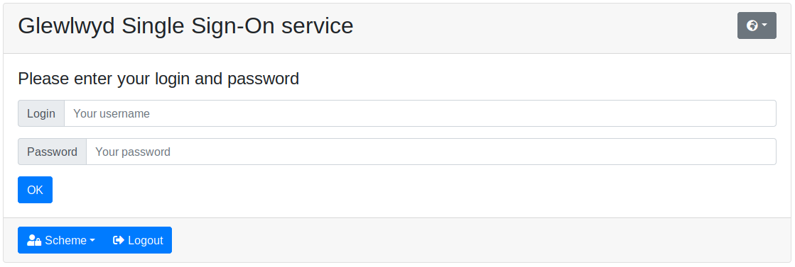
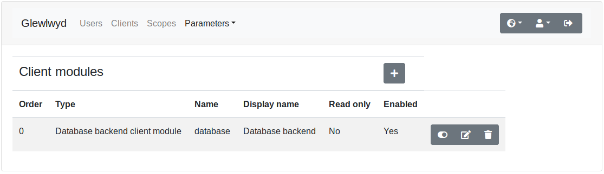
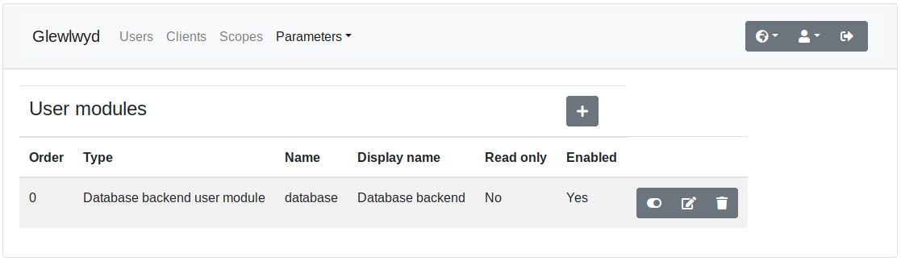
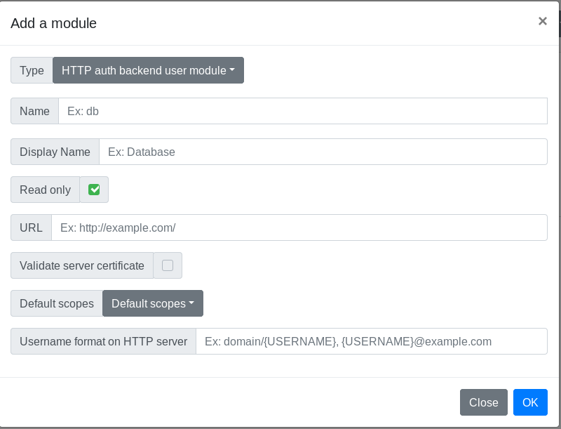
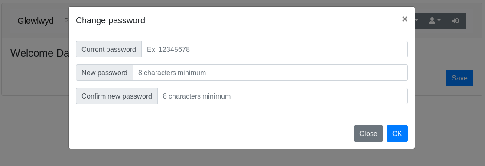
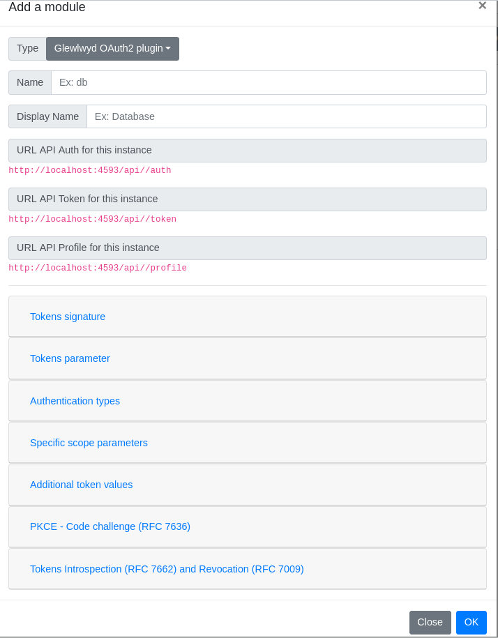

# Glewlwyd screenshots

Screenshots available

## Login page

### Simple login with password

### Login without password

### Grant client access to scopes for the user

### Multiple session selector

### Logged in

## Admin page

### User list

### Client list

### Scope list

### Scope add

### List of user modules instanciated

### User database backend module configuration

### User HTTP backend module configuration

### User LDAP backend module configuration

### Client LDAP backend module configuration

### Scheme list

### OTP E-mail scheme configuration

### OATH HOTP/TOTP scheme configuration

### Webauthn scheme configuration

## Profile page

### User profile data editor

### User profile change password

### User profile session and tokens manager

### User profile OTP configuration

### User profile Webauthn configuration

### User profile TLS certificate configuration

### List of plugins instanciated

### OAuth2 plugin configuration

### OIDC plugin configuration

